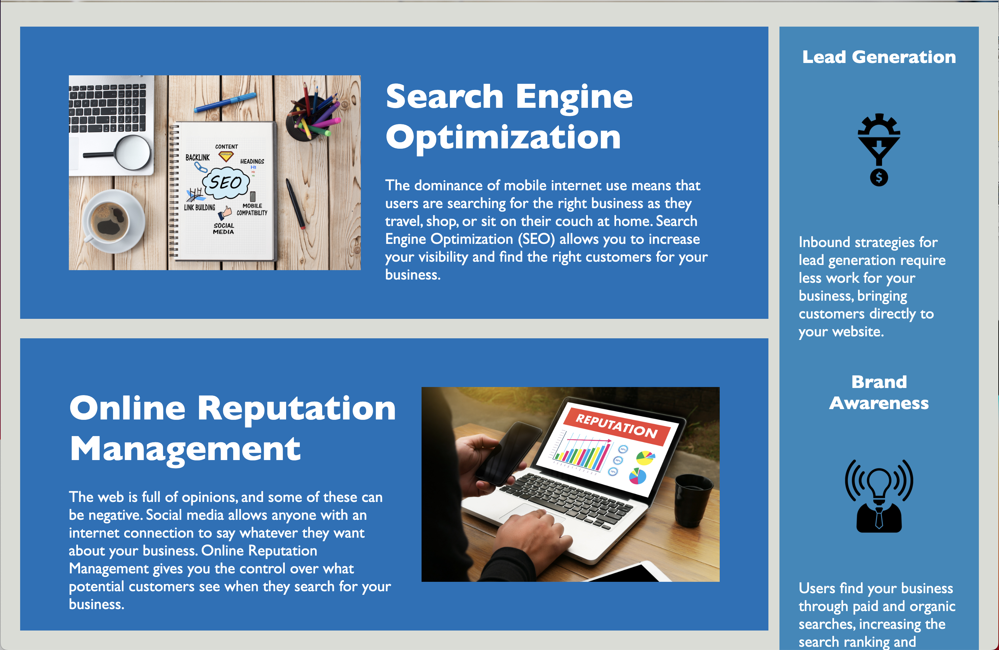
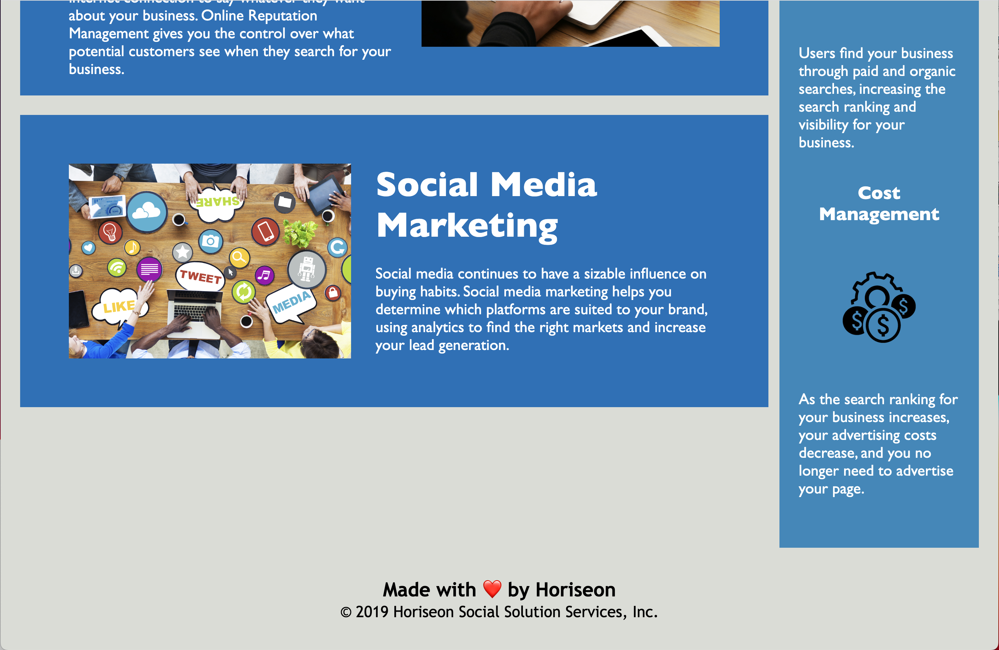

# <Week 1 Challenge - Horiseon Webpage>

## Description

The goal of this project was to refactor html and css to be cleaner and to follow semantic and workflow standards.

My biggest challenge was in the CSS and resizing the main "hero" image to match the one we were given as an example. 

Other challenges involved details when consolodating CSS class elements and therefore needing to create more efficient classes in the html doc. 

Additionally, creating my GitHub branches taught me alot about Git Flow, and I realized that I still have alot to learn about the process of moving back an forth between the CLI, VS Code, switching branches, pushing and pulling data, etc. 

This was also a great opportunity to explore what CSS does by altering different parameters and researching ways to do different things.

## Usage
Click on the top menu to navigate to different sections of the webpage. 

